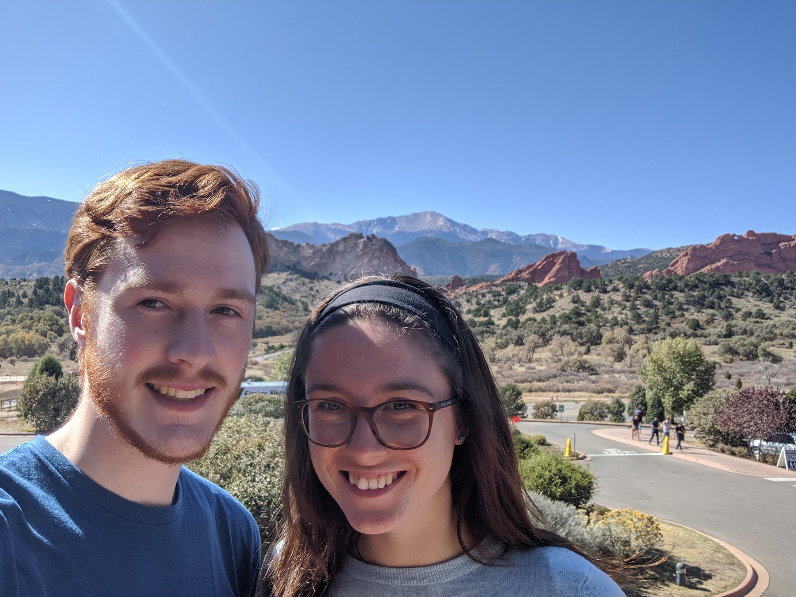

Hello, welcome to my website, my name is Michael Burton and I am a graduate of North Carolina State University's masters of statistics program. I am currently working as a Biostatistician and am thrilled to be contributing to such an amazing field.

If you would like to learn more about my skill set you can click [here](https://michaeleburton.github.io/about/). 

## Professional Interests
+ Programming (Statistical or not; I am currently teaching myself [C++](https://github.com/MichaelEBurton/PPP_Cpp))
  - [SAS](https://github.com/MichaelEBurton/SAS_Samples), R, Python, SQL, C++ 
+ Statistical Data Analysis
+ Machine Learning (I'm was recently in a [deep learning reading group](https://github.com/AlvinSheng/SLG-Deep-Learning))

## Hobbies
+ Canoeing (**not kayaking!**)
  - During the summer of 2017, I was a canoe guide at [Northern Tier](https://www.ntier.org) BSA national high adventure base located next to [Boundary Waters Canoe Area Wilderness](https://www.fs.usda.gov/detail/superior/specialplaces/?cid=fseprd555184).
+ Backpacking/Hiking
+ Rock Climbing
+ Bowling

## Resources
As someone who is always eager to learn new and exciting technologies here is a list of some resources that I've found helpful, or think will be useful in the future.
     
+ Books I'm paging my way through 
  - [Programming -- Principles and Practice using C++](http://www.stroustrup.com/Programming/)
  
  
  
+ Books of interest
  - [Advanced R](http://adv-r.had.co.nz/)
  - [Introduction to Statistical Learning](http://faculty.marshall.usc.edu/gareth-james/ISL/)
  - [Elements of Statistical Learning](https://web.stanford.edu/~hastie/ElemStatLearn/)
  - [Deep Learning](https://www.deeplearningbook.org/)
  - [Deep Learning with R](https://www.manning.com/books/deep-learning-with-r)
  - [A whirlwind tour of Python](https://jakevdp.github.io/WhirlwindTourOfPython/)
  - [Python Data Science Handbook](https://jakevdp.github.io/PythonDataScienceHandbook/)
  - [The Linux Command Line](http://linuxcommand.org/tlcl.php)
  - [Learning SAS by Example](https://www.sas.com/store/books/categories/getting-started/learning-sas-by-example-a-programmer-s-guide-second-edition/prodBK_71442_en.html)

+ Wishlist
  - [Data Structures and Algorithms in Python](https://www.amazon.com/Structures-Algorithms-Python-Michael-Goodrich/dp/1118290275)
  
## Contact Me
If you would like to get in touch with me about potential job opportunities, statistics, machine learning, or the BWCAW, shoot me an email.

+ Email: [meburton@ncsu.edu](mailto:meburton@ncsu.edu)
+ Github: [MichaelEBurton](https://github.com/MichaelEBurton)
+ LinkedIn: [MichaelEBurton](https://www.linkedin.com/in/michaeleburton/)

